# Application Flowchart

This diagram describes the current runtime architecture of the multi-tenant application. It includes the public site, storefront, Payload CMS, social publishing, payment processing, persistence, and the Docker deployment shape.

```mermaid
flowchart TB
  %% Styling: blue = application entry/UI, green = service/module, yellow = data,
  %% red = external system, purple = background/operations.
  classDef entry fill:#E8F1FF,stroke:#2563EB,color:#172554
  classDef service fill:#ECFDF5,stroke:#059669,color:#064E3B
  classDef data fill:#FFFBEB,stroke:#D97706,color:#78350F
  classDef external fill:#FEF2F2,stroke:#DC2626,color:#7F1D1D
  classDef worker fill:#F5F3FF,stroke:#7C3AED,color:#4C1D95
  classDef security fill:#FFF1F2,stroke:#E11D48,color:#881337

  subgraph actors["Users and external parties"]
    Visitor["Visitor / patient"]
    Shopper["Store customer"]
    Editor["Platform operator or tenant editor"]
    Provider["Social platform user"]
    Gateway["Paymob or Kashier"]
    Mail["SMTP or email provider"]
  end

  subgraph delivery["Container and request entry"]
    Supervisor["Docker supervisor\nprocess lifecycle and control API"]
    Migrate["Payload migrations\nand idempotent tenant seed"]
    Astro["Astro Node SSR server\npublic origin :4321"]
    Middleware["Astro middleware\ntenant, locale, feature, and proxy rules"]
    DashboardProxy["Dashboard reverse proxy\n/admin, /_next, and Payload /api"]
    PayloadNext["Payload on Next.js\nadmin and REST origin :3001"]
  end

  subgraph publicSite["Public-site rendering and tenant experience"]
    TenantResolve["Host or TENANT_SLUG\ntenant resolution with 60 second cache"]
    LocaleGate["Locale validation and redirect\nper-tenant enabled/default languages"]
    FeatureGate["Feature-route gate\nrewrite unavailable modules to 404"]
    PageRoutes["Astro route modules\npublic, portal, shop, and API routes"]
    Layouts["Layouts and UI\nAstro templates, Vue islands, Tailwind"]
    I18n["i18n catalogue\nlocalized map and fallback selection"]
    TenantBrand["Tenant overlay\nbranding, contact, healthcare settings"]
    CmsFacade["CMS facade\nCMS_MODE selects a backend"]
    InProcess["In-process Payload Local API\ndefault content-read backend"]
    RestCms["Payload REST client\nCMS_MODE=api fallback backend"]
    ContentMap["Shared CMS mappers\nlocalized content, image URLs, schemas"]
  end

  subgraph storefront["Storefront and commerce boundary"]
    ShopUI["Vue shop components\ncatalog, cart, checkout, account, orders"]
    StoreBFF["Astro /api/store/v2 BFF\nroute mapping and response shaping"]
    CompatBFF["Legacy /api/store BFF\ncompatibility endpoints"]
    StoreCookies["HttpOnly cookies\nstore cart and customer session"]
    GatewaySign["Commerce gateway signing\ncanonical request, nonce, HMAC"]
    StoreEndpoints["Payload store endpoints\ncatalog, cart, quote, auth, checkout, orders"]
    StoreAuth["Customer auth\nregister, login, reset, verification"]
    Quote["Authoritative quote\nprices, tax, shipping, promotions, gift cards"]
    Checkout["Checkout orchestration\nidempotent order draft and reservation"]
    Inventory["Inventory service\nSKU resolution, reservations, commit or release"]
    PaymentAdapters["Payment adapters\nPaymob and Kashier"]
  end

  subgraph portal["Patient portal integration"]
    PortalUI["Vue portal components\nsign up, OTP sign-in, appointments, booking, admin"]
    PortalClient["Portal API client\nlocalized response mapping and cookie credentials"]
    PortalBackend["External patient portal API\nidentity, clinics, providers, slots, appointments"]
  end

  subgraph cmsCore["Payload configuration, tenancy, and domain data"]
    PayloadConfig["Payload configuration\ncollections, endpoints, jobs, localization"]
    Access["Access and feature plugins\nroles, tenant scope, collection gating"]
    TenantDomain["Tenants and tenant types\ndomains, languages, branding, feature flags"]
    ContentCollections["Content collections\narticles, departments, doctors, events, awards, achievements, testimonials"]
    VerticalSettings["Vertical settings registry\nhealthcare and commerce singleton settings"]
    CommerceModels["Commerce models\nproducts, variants, carts, addresses, orders, transactions"]
    PolicyModels["Commerce policies\ntax, shipping, promotions, gift cards"]
    InventoryModels["Inventory models\nlocations, levels, movements, reservations, transfers"]
    PaymentEvents["Payment events\ndurable, idempotent webhook record"]
    UserModels["Users and customers\nPayload auth and per-tenant permissions"]
    Media["Media and shared icons"]
  end

  subgraph social["Social connections and durable publishing"]
    SocialAdmin["CMS social settings UI"]
    OAuth["Payload /api/social endpoints\nOAuth state, callback, selection, disconnect"]
    OAuthState["OAuth and selection state\none-time, signed, encrypted"]
    Connections["Social connections\nencrypted provider tokens"]
    ArticleHook["Article after-change hook\nselects eligible auto-publish targets"]
    SocialJob["social-publish-article job\nbounded retry and idempotent fan-out"]
    SocialAdapters["Platform adapter registry\nreal or explicitly deferred adapters"]
    Publications["Social publications\none result per article and platform"]
    SocialPlatforms["Facebook, Instagram, LinkedIn, X, YouTube, TikTok, Threads"]
  end

  subgraph async["Background jobs and payment finality"]
    PayloadJobs["Payload job queues\nsocial-publishing and commerce\nauto-run or worker"]
    Webhook["Payload payment webhook endpoint\nverify signature and ACK"]
    PaymentJob["process-payment-event job\nfold state and run idempotent side effects"]
    NotificationJob["send-commerce-notification job\nrender, dedupe, and retry"]
  end

  subgraph persistence["Persistence and deployment"]
    SQLite[("libSQL / SQLite\nWAL-backed cms.db")]
    Uploads[("Media uploads\nserved by Payload or Astro path")]
    Image["Docker image\nAstro plus Payload runtime"]
    CI["GitHub Actions\ncurrent static build and Pages deployment workflow"]
  end

  %% Application boot and public-page request
  Supervisor --> Migrate
  Supervisor --> Astro
  Supervisor -. "starts on demand or continuously" .-> PayloadNext
  Migrate --> SQLite
  Image --> Supervisor

  Visitor --> Astro
  Shopper --> Astro
  Editor --> Astro
  Astro --> Middleware
  Middleware --> TenantResolve
  TenantResolve --> CmsFacade
  Middleware --> LocaleGate
  Middleware --> FeatureGate
  FeatureGate --> PageRoutes
  LocaleGate --> PageRoutes
  PageRoutes --> Layouts
  PageRoutes --> I18n
  PageRoutes --> TenantBrand
  TenantBrand --> CmsFacade
  CmsFacade --> InProcess
  CmsFacade -. "CMS_MODE=api" .-> RestCms
  InProcess --> PayloadConfig
  RestCms --> PayloadNext
  PayloadConfig --> ContentMap
  ContentMap --> Layouts
  ContentMap --> Uploads
  I18n --> Layouts
  TenantDomain --> TenantResolve
  VerticalSettings --> TenantBrand
  ContentCollections --> ContentMap
  Media --> ContentMap
  Layouts --> Visitor

  %% Payload dashboard proxy and CMS authoring
  Middleware -. "dashboard paths" .-> DashboardProxy
  DashboardProxy -. "ensure running" .-> Supervisor
  DashboardProxy --> PayloadNext
  Editor --> DashboardProxy
  PayloadNext --> PayloadConfig
  PayloadConfig --> Access
  Access --> TenantDomain
  Access --> ContentCollections
  Access --> VerticalSettings
  Access --> CommerceModels
  Access --> PolicyModels
  Access --> InventoryModels
  Access --> UserModels
  PayloadConfig --> Media
  TenantDomain --> SQLite
  ContentCollections --> SQLite
  VerticalSettings --> SQLite
  CommerceModels --> SQLite
  PolicyModels --> SQLite
  InventoryModels --> SQLite
  PaymentEvents --> SQLite
  UserModels --> SQLite
  Media --> SQLite
  Media --> Uploads

  %% Storefront request and order lifecycle
  PageRoutes --> ShopUI
  ShopUI --> StoreBFF
  ShopUI -. "older clients" .-> CompatBFF
  StoreBFF --> StoreCookies
  CompatBFF --> StoreCookies
  StoreBFF --> GatewaySign
  GatewaySign --> StoreEndpoints
  CompatBFF -. "tenant-bound proxy" .-> StoreEndpoints
  StoreEndpoints --> StoreAuth
  StoreEndpoints --> Quote
  StoreEndpoints --> Checkout
  StoreEndpoints --> CommerceModels
  StoreEndpoints --> PolicyModels
  Quote --> CommerceModels
  Quote --> PolicyModels
  Checkout --> Quote
  Checkout --> Inventory
  Checkout --> CommerceModels
  Inventory --> InventoryModels
  Checkout --> PaymentAdapters
  PaymentAdapters --> Gateway
  StoreAuth --> UserModels
  StoreEndpoints --> ShopUI

  %% Patient portal request and appointment lifecycle
  PageRoutes --> PortalUI
  PortalUI --> PortalClient
  PortalClient --> PortalBackend
  PortalBackend --> PortalUI

  %% Payment webhook finality and notifications
  Gateway --> Webhook
  Webhook --> PaymentEvents
  Webhook --> PayloadJobs
  PayloadJobs --> PaymentJob
  PaymentJob --> CommerceModels
  PaymentJob --> Inventory
  PaymentJob --> NotificationJob
  NotificationJob --> Mail

  %% Social connection and publishing lifecycle
  SocialAdmin --> OAuth
  OAuth --> OAuthState
  OAuth --> Connections
  OAuth --> SocialPlatforms
  Provider --> SocialPlatforms
  Connections --> SQLite
  OAuthState --> SQLite
  ContentCollections --> ArticleHook
  ArticleHook --> PayloadJobs
  PayloadJobs --> SocialJob
  SocialJob --> Connections
  SocialJob --> SocialAdapters
  SocialAdapters --> SocialPlatforms
  SocialJob --> Publications
  Publications --> SQLite

  %% Build and deployment reference
  CI -. "builds Astro package" .-> Image

  class Visitor,Shopper,Editor,Provider entry
  class Astro,Middleware,DashboardProxy,PayloadNext,PageRoutes,Layouts,ShopUI,PortalUI,StoreBFF,CompatBFF,SocialAdmin entry
  class TenantResolve,LocaleGate,FeatureGate,TenantBrand,CmsFacade,InProcess,RestCms,ContentMap,PortalClient,GatewaySign,StoreEndpoints,StoreAuth,Quote,Checkout,Inventory,PaymentAdapters,PayloadConfig,Access,ArticleHook,SocialJob,SocialAdapters,Webhook,PaymentJob,NotificationJob service
  class TenantDomain,ContentCollections,VerticalSettings,CommerceModels,PolicyModels,InventoryModels,PaymentEvents,UserModels,Media,OAuthState,Connections,Publications,SQLite,Uploads,StoreCookies data
  class Gateway,Mail,SocialPlatforms,PortalBackend external
  class Supervisor,Migrate,PayloadJobs,Image,CI worker
  class I18n security
```

## How to read it

- Public requests always enter Astro first. Middleware resolves the tenant from the host, enforces that tenant's enabled languages and feature flags, and then lets the matching Astro route render.
- The frontend reads CMS data through `astro/src/cms/`. In-process Payload Local API reads are the default; setting `CMS_MODE=api` switches those reads to CMS REST without changing page code.
- `/admin`, `/_next/*`, and non-store `/api/*` traffic can be proxied by Astro to the on-demand Payload dashboard. Storefront `/api/store/*` remains Astro-owned.
- The patient portal is a Vue island integration with a separate backend. It uses that backend's cookie-based session for OTP authentication and appointment management; it is not stored in Payload.
- Shop traffic uses the signed `/api/store/v2/*` gateway. The browser never receives gateway secrets, customer session tokens, or cart IDs; those are handled with server-side signatures and HttpOnly cookies.
- Payment redirects are not authoritative. Only a verified Paymob/Kashier webhook creates a durable payment event; a background job folds the state, finalizes inventory/order effects, and queues any email.
- Saving an eligible article can enqueue a social-publishing job. The worker loads encrypted tenant connections, delegates to the appropriate adapter, and records an idempotent per-platform publication result.

## Scope notes

- The diagram represents active application modules. `astro/src/content/**` and CMS import/export scripts are retained as legacy seed or migration helpers, not part of the live request path.
- The GitHub Pages workflow remains in the repository, but the active runtime architecture is the Node/Docker deployment shown above. Keeping the workflow is useful as a build artifact path; it is not sufficient for the live CMS-backed SSR runtime by itself.
